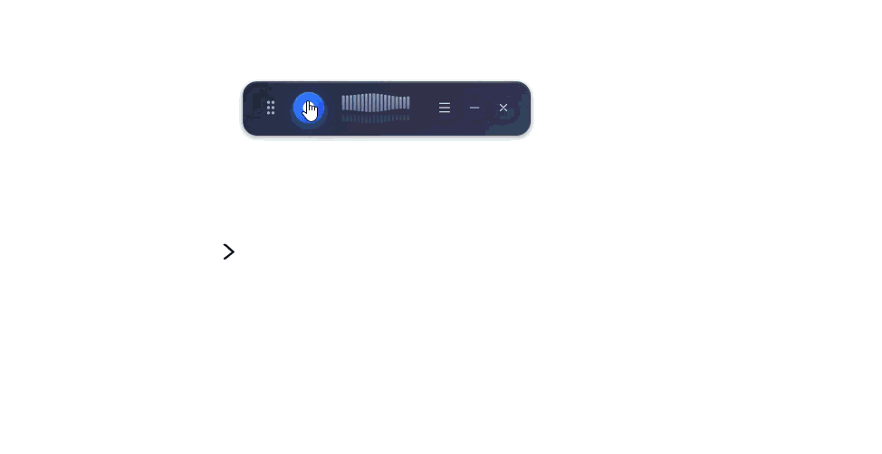

# Voice Transcriber

A modern, cross-platform desktop application for real-time voice transcription using OpenAI's latest transcription models. Features a sleek floating interface, intelligent silence detection, and seamless auto-paste functionality.

<p align="center">
  
</p>

## Features

### Core Functionality
- **Real-time Voice Recording** - High-quality audio capture with live waveform visualization
- **Multiple AI Models** - Support for GPT-4o Transcribe, GPT-4o Mini, and Whisper-1
- **Streaming Transcription** - Real-time text output for supported models
- **Global Hotkeys** - Start/stop recording from any application
- **Auto-paste** - Automatically paste transcribed text to your active application

### Smart Recording
- **Intelligent Silence Detection** - Automatically stops recording when you finish speaking
- **Speech Confirmation** - Distinguishes between actual speech and ambient noise
- **Adaptive Threshold** - Calibrates to your environment's noise floor
- **Configurable Duration** - Set silence threshold from 2-5 seconds

### User Experience
- **Floating Compact Bar** - Minimal, always-on-top interface that stays out of your way
- **Collapsible Design** - Auto-minimizes to a small chip when inactive
- **Transcription History** - Search, filter, and export past transcriptions
- **System Tray Integration** - Runs quietly in the background
- **Cross-platform** - Works on Windows, macOS, and Linux

### Security
- **Encrypted API Key Storage** - Your OpenAI API key is stored securely
- **Local Processing** - Audio is sent directly to OpenAI, not stored locally

## Installation

### Prerequisites

- Node.js 18+ and npm
- OpenAI API key ([get one here](https://platform.openai.com/api-keys))
- Microphone access

### Quick Start

1. **Clone the repository:**
   ```bash
   git clone https://github.com/user/voice-transcriber.git
   cd voice-transcriber
   ```

2. **Install dependencies:**
   ```bash
   npm install
   ```

3. **Run in development mode:**
   ```bash
   npm run dev
   ```

### Building for Production

#### Windows
```bash
npm run package:win
```
Outputs: `release/*.exe` (installer) and `release/win-unpacked/` (portable)

#### macOS
```bash
npm run package:mac
```
Output: `release/*.dmg`

#### Linux
```bash
npm run package:linux
```
Outputs: `release/*.AppImage` and `release/*.deb`

## Usage

### First Launch Setup

On first launch, a setup wizard guides you through:

1. **API Key** - Enter your OpenAI API key
2. **Model Selection** - Choose your preferred transcription model
3. **Hotkey Configuration** - Set your global keyboard shortcut
4. **Microphone Selection** - Choose your input device

### Recording Methods

#### Method 1: Click to Record
1. Click the microphone button in the compact bar
2. Speak clearly into your microphone
3. Click again to stop, or wait for silence detection

#### Method 2: Global Hotkey (Recommended)
1. Press your configured hotkey (default: `Ctrl+Shift+Space`)
2. Speak your message
3. Press the hotkey again OR simply stop speaking
4. Text is automatically pasted to your active application

### Smart Silence Detection

The app uses an intelligent algorithm to detect when you've finished speaking:

- **Calibration Phase** - First 1.5 seconds calibrate to ambient noise
- **Speech Confirmation** - Requires 3+ consecutive speech samples before listening for silence
- **Adaptive Threshold** - Adjusts to your speaking volume dynamically
- **Consecutive Silence** - Requires sustained silence (not just a brief pause)

This means the recording won't stop from:
- Brief pauses between sentences
- Background ambient noise
- Momentary sounds like keyboard clicks

### Settings Panel

Access settings by clicking the menu icon in the compact bar:

<p align="center">
  
</p>

#### API Configuration
| Setting | Description |
|---------|-------------|
| API Key | Your OpenAI API key (stored encrypted) |
| Model | GPT-4o Transcribe, GPT-4o Mini, or Whisper-1 |

#### Recording Settings
| Setting | Description |
|---------|-------------|
| Max Duration | 30 seconds to 5 minutes |
| Input Device | Select your microphone |
| Silence Detection | Enable/disable auto-stop |
| Silence Duration | 2-5 seconds of silence to trigger stop |

#### Behavior Settings
| Setting | Description |
|---------|-------------|
| Auto-paste | Automatically paste transcribed text |
| Launch at Startup | Start app when system boots |
| Start Minimized | Start in system tray |

#### Advanced Settings (Whisper-1 only)
| Setting | Description |
|---------|-------------|
| Response Format | text, json, verbose_json, srt, vtt |
| Language | ISO-639-1 code or auto-detect |
| Temperature | 0-1, controls transcription creativity |

### History Management

The History tab provides:
- **Search** - Find transcriptions by text content
- **Date Filter** - Filter by date range
- **Sort** - Order by date or duration
- **Export** - Save as TXT, JSON, or SRT format
- **Copy** - Quick copy to clipboard

## Model Comparison

| Feature | GPT-4o Transcribe | GPT-4o Mini | Whisper-1 |
|---------|-------------------|-------------|-----------|
| **Accuracy** | Highest | High | Good |
| **Speed** | Fast | Faster | Fast |
| **Streaming** | Yes | Yes | No |
| **Timestamps** | No | No | Yes |
| **SRT/VTT Export** | No | No | Yes |
| **Cost** | $$$ | $$ | $ |
| **Best For** | Critical accuracy | Daily use | Subtitles |

### Choosing the Right Model

- **GPT-4o Transcribe** - Best accuracy, ideal for important documents or complex terminology
- **GPT-4o Mini Transcribe** - Great balance of speed, accuracy, and cost for everyday use
- **Whisper-1** - Best for creating subtitles or when you need timestamps

## Keyboard Shortcuts

| Action | Default Shortcut | Customizable |
|--------|-----------------|--------------|
| Start/Stop Recording | `Ctrl+Shift+Space` | Yes |
| Alternative Options | `Ctrl+Alt+R`, `F9`, `F10` | Yes |

## Technical Specifications

### Audio
- **Format**: WebM/Opus (auto-captured)
- **Sample Rate**: 16kHz
- **Max File Size**: 25MB (OpenAI limit)
- **Max Duration**: Configurable (30s - 5 minutes)

### Silence Detection Algorithm
- **Check Interval**: 100ms
- **Calibration Duration**: 1.5 seconds
- **Speech Threshold**: 4x baseline noise
- **Silence Threshold**: 20% of peak speech level
- **Confirmation**: 3 speech samples, 5 silence samples

## Troubleshooting

### Microphone Issues

| Problem | Solution |
|---------|----------|
| No microphone found | Ensure a microphone is connected and recognized by your OS |
| Permission denied | Grant microphone access in system settings |
| Microphone in use | Close other applications using the microphone |
| Low audio level | Check microphone volume in system settings |

### Recording Issues

| Problem | Solution |
|---------|----------|
| Recording stops too quickly | Increase silence duration in settings |
| Recording doesn't stop | Disable silence detection or speak more clearly |
| Audio not detected | Check input device selection in settings |

### API Errors

| Error | Solution |
|-------|----------|
| Invalid API key | Verify your key at platform.openai.com |
| Rate limit exceeded | Wait a moment and try again |
| Network error | Check your internet connection |
| File too large | Recording is limited to 25MB |

### Auto-paste Issues

| Problem | Solution |
|---------|----------|
| Text not pasting | Ensure an input field is focused before recording |
| Paste delayed | Normal - app needs to refocus the target window |
| Linux Wayland | May not work; use X11 or copy from history |

## Project Structure

```
voice-transcriber/
├── src/
│   ├── main/                 # Electron main process
│   │   ├── index.ts          # App entry, window management, IPC
│   │   ├── transcription.ts  # OpenAI API integration
│   │   ├── shortcuts.ts      # Global hotkey registration
│   │   └── tray.ts           # System tray management
│   ├── preload/              # Electron preload scripts
│   │   └── index.ts          # IPC bridge (contextBridge)
│   ├── renderer/             # React frontend
│   │   ├── components/       # UI components
│   │   │   └── CompactBar.tsx    # Main recording interface
│   │   ├── hooks/            # Custom React hooks
│   │   │   └── useAudioRecorder.ts  # Recording + silence detection
│   │   ├── pages/            # Application pages
│   │   │   ├── PanelWindow.tsx   # Settings & History
│   │   │   └── Setup.tsx         # First-launch wizard
│   │   ├── store/            # State management (Zustand)
│   │   ├── utils/            # Utility functions
│   │   └── App.tsx           # Root component
│   └── shared/               # Shared types and constants
│       └── types.ts          # TypeScript interfaces
├── assets/                   # Application icons
├── dist/                     # Build output
└── release/                  # Packaged applications
```

## Development

### Available Scripts

```bash
npm run dev              # Start development mode (Vite + Electron)
npm run build            # Build for production
npm run build:vite       # Build frontend only
npm run build:electron   # Build main process only
npm run package          # Package for current platform
npm run package:win      # Package for Windows
npm run package:mac      # Package for macOS
npm run package:linux    # Package for Linux
```

### Tech Stack

| Layer | Technology |
|-------|------------|
| Framework | Electron 28 |
| Frontend | React 18 + TypeScript |
| Styling | Tailwind CSS |
| State | Zustand |
| Build | Vite 5 |
| API | OpenAI SDK 4.x |
| Audio | Web Audio API + MediaRecorder |
| Auto-type | @nut-tree-fork/nut-js |

### Adding Features

1. **IPC Channels**: Update `src/shared/types.ts`, `src/preload/index.ts`, `src/main/index.ts`
2. **UI Components**: Create in `src/renderer/components/`
3. **State**: Update `src/renderer/store/configStore.ts`

## Contributing

Contributions are welcome! Please:

1. Fork the repository
2. Create a feature branch (`git checkout -b feature/amazing-feature`)
3. Make your changes
4. Test thoroughly
5. Commit (`git commit -m 'Add amazing feature'`)
6. Push (`git push origin feature/amazing-feature`)
7. Open a Pull Request

## License

MIT License - see [LICENSE](LICENSE) file for details.

## Author

**Bhukya Yedukondalu Naik**
Email: bhukya@hellotars.com

## Acknowledgments

- [Electron](https://www.electronjs.org/) - Cross-platform desktop framework
- [OpenAI](https://openai.com/) - Transcription API
- [Tailwind CSS](https://tailwindcss.com/) - Utility-first CSS
- [Lucide](https://lucide.dev/) - Beautiful icons
- [Zustand](https://zustand-demo.pmnd.rs/) - State management

## Roadmap

- [ ] Real-time streaming text display during transcription
- [ ] Multiple language support in UI
- [ ] Custom vocabulary/terminology support
- [ ] Batch transcription from audio files
- [ ] Speaker diarization (when available in API)
- [ ] Cloud sync for transcription history
- [ ] Plugin system for integrations
- [ ] Voice commands for app control

---

**Note**: This application requires an active internet connection and a valid OpenAI API key. API usage is billed according to [OpenAI's pricing](https://openai.com/pricing).
