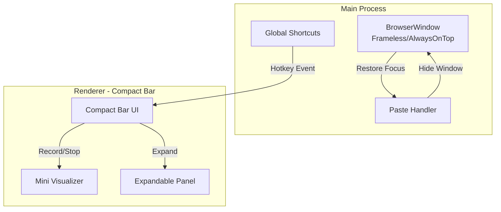

# Compact Floating Voice Transcriber UI

## Architecture Overview



## 1. Fix Global Hotkey Registration

**Problem**: Shortcuts only register when `config.apiKey` exists at startup, but after setup completion, hotkeys don't get registered.

**File**: [src/main/index.ts](src/main/index.ts)

**Changes**:

- Register shortcuts immediately after `completeSetup` IPC call
- Add logging to debug shortcut registration
- Ensure shortcuts work even when window is hidden
```typescript
// In config:completeSetup handler, add:
ipcMain.handle('config:completeSetup', () => {
  store.set('isFirstLaunch', false);
  const config = store.get('config');
  if (config.apiKey) {
    registerShortcuts(config.hotkey, () => {
      mainWindow?.webContents.send(IPC_CHANNELS.HOTKEY_TRIGGERED);
    });
  }
  return true;
});
```


## 2. Create Compact Floating Bar Window

**File**: [src/main/index.ts](src/main/index.ts)

**Window Configuration**:

- Frameless window with `alwaysOnTop: true`
- Positioned at top-center of screen
- Size: ~300x48px (idle) expanding to ~300x200px (settings/history)
- Transparent background with rounded corners
- Draggable via custom title bar region
```typescript
mainWindow = new BrowserWindow({
  width: 300,
  height: 48,
  frame: false,
  transparent: true,
  alwaysOnTop: true,
  resizable: false,
  skipTaskbar: true,
  x: Math.floor((screen.width - 300) / 2),
  y: 20,
  webPreferences: { /* ... */ }
});
```


**New IPC Channels** to add:

- `window:expand` - Resize window for settings/history panel
- `window:collapse` - Return to compact bar size
- `window:setPosition` - Allow dragging

## 3. Redesign Renderer UI - Compact Bar

**New File**: `src/renderer/components/CompactBar.tsx`

**Layout (idle state)**:

```
[Drag Handle] [Record Button] [Status/Timer] [Visualizer] [History] [Settings] [Close]
```

**States**:

- **Idle**: Compact bar with record button, hotkey hint
- **Recording**: Pulsing record indicator, live visualizer, timer, stop button
- **Transcribing**: Spinner with progress indication
- **Expanded**: Panel slides down for settings/history

**File Changes**:

- Refactor [src/renderer/App.tsx](src/renderer/App.tsx) to use new CompactBar
- Create `src/renderer/components/CompactBar.tsx` - main compact UI
- Create `src/renderer/components/ExpandablePanel.tsx` - settings/history panel
- Update [src/renderer/pages/Home.tsx](src/renderer/pages/Home.tsx) - integrate into compact layout

## 4. Fix Paste Functionality (Window Focus Issue)

**Problem**: When paste is triggered, the transcriber window has focus, not the target app.

**File**: [src/main/index.ts](src/main/index.ts)

**Solution**: Hide window before paste, wait for focus to shift, then paste.

```typescript
ipcMain.handle(IPC_CHANNELS.PASTE_TEXT, async (_, text: string) => {
  clipboard.writeText(text);
  
  // Hide window to restore focus to previous app
  mainWindow?.hide();
  
  // Small delay to let OS shift focus
  await new Promise(resolve => setTimeout(resolve, 100));
  
  // Now paste
  const { keyboard, Key } = await import('@nut-tree-fork/nut-js');
  // ... paste logic
  
  // Optionally show window again after paste
  mainWindow?.show();
});
```

## 5. Enhanced Audio Visualizer

**File**: [src/renderer/components/WaveformVisualizer.tsx](src/renderer/components/WaveformVisualizer.tsx)

**Improvements**:

- Fix prop mismatch: component expects `audioStream` but receives `audioLevel`
- Add gradient colors that respond to audio intensity
- Add glow/pulse effects during recording
- Create compact mini-visualizer variant for the bar (5-7 bars)
- Smoother animations with CSS transitions

**New Visual Effects**:

- Gradient bars from blue to red based on intensity
- Subtle glow effect around active bars
- Bounce animation on peaks
- Smooth decay animation when stopping

## 6. Dynamic Window Resizing

**New IPC handlers** in [src/main/index.ts](src/main/index.ts):

```typescript
ipcMain.handle('window:resize', (_, { width, height }) => {
  mainWindow?.setSize(width, height, true); // animate
});
```

**Preload additions** in [src/preload/index.ts](src/preload/index.ts):

- `resizeWindow(width, height)`
- `setAlwaysOnTop(flag)`

## Files to Modify

| File | Changes |

|------|---------|

| `src/main/index.ts` | Window config, paste fix, resize IPC, shortcut fix |

| `src/preload/index.ts` | Add resize/position APIs |

| `src/renderer/App.tsx` | Use CompactBar, remove old layout |

| `src/renderer/components/WaveformVisualizer.tsx` | Fix props, add effects |

| `src/renderer/pages/Home.tsx` | Simplify for compact mode |

## Files to Create

| File | Purpose |

|------|---------|

| `src/renderer/components/CompactBar.tsx` | Main floating bar UI |

| `src/renderer/components/MiniVisualizer.tsx` | Small inline visualizer |

| `src/renderer/components/ExpandablePanel.tsx` | Settings/history dropdown |

## CSS Updates

**File**: [src/renderer/index.css](src/renderer/index.css)

- Add drag region styles (`-webkit-app-region: drag`)
- Glassmorphism effect for compact bar
- Glow/pulse animations for visualizer
- Smooth height transitions for expandable panel